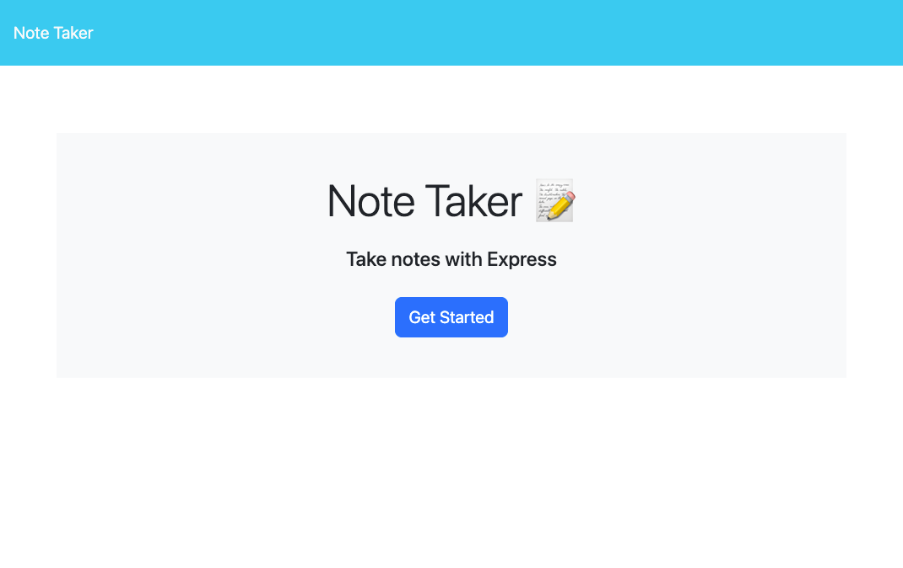
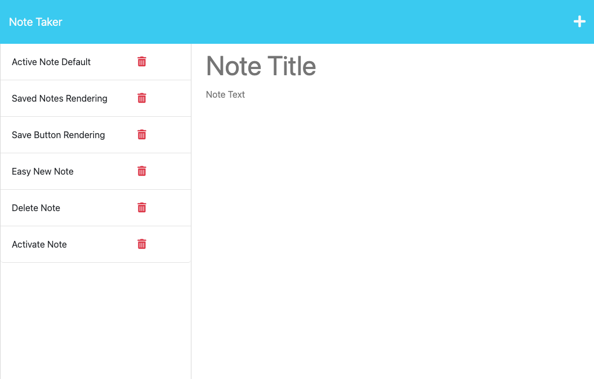
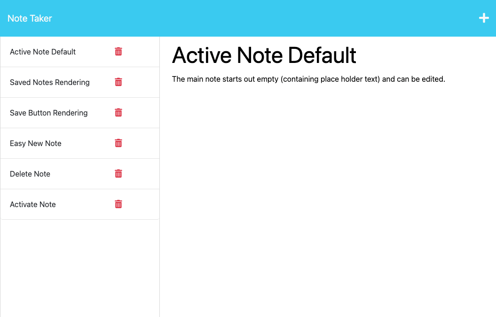

# kwikNote


## DESCRIPTION

kwikNote is the fastest way to free your mind!

A simple note-taking app that can take, save, and delete notes.


# TABLE OF CONTENTS

1. [Installation](#installation)
2. [Usage](#usage)
3. [Mock-Up](#mock-up)
4. [App Links](#app-links)
5. [Contributing](#contributing)
6. [Tests](#tests)
7. [License](#license)
8. [Questions](#questions)

# INSTALLATION
To install:
1. Download the code from gitHub
2. In the terminal, run: npm i
3. Then run: 
```
npm start
```
4. Click the link on the terminal
5. When the browser opens, the app is served!


# USAGE
To launch the app:
1. Open the browser
2. Type in the URL as 
```
localhost:3001
```
3. The app opens and notes can be entered

To See Saved Notes:
1. View the notes on the left sidebar
2. Click on the preferred note title
3. The note opens in the main area
4. The note text will appear in the main text area

To Edit Notes:
1. Click on the title to edit the title
2. Click on the text body to edit the text
3. If note was edited, a save button is visible and can be clicked

To Create a New Note:
1. Click ont the ' + ' on the top right of the page
2. The display clears any writing in the title and text area of the main/active note area
3. Placeholder text is visible
4. To create a note, click in the title or the text area of the main/active note area

To Delete a Saved Note
1. Click the trash can icon on the note 
2. The note is deleted from the list
  
# MOCK-UP

The following images show the app's functionality:

The landing page when the app is first launched appears as below:


The Notes page, as it appears when it is first launched appears as below:


To view a saved note, click on the note and it will appear as below:


The following animation shows the process of saving a note:


# APP LINKS

## GitHub Repository

The source for the application is available at my gitHub repo: [kwikNote GitHub Repo](https://github.com/vasudevap/kwikNote.git)

## Live Running App

The running application for immediate use online can be found at: [kwikNote App LIVE Online (at Heroku)](https://kwiknote-9d0997e988ee.herokuapp.com/)

# CONTRIBUTING
More the merrier!  Join me in my quest to deliver the coders of the world from painful note-taking systems!  Contact me on my gitHub!

# LICENSE
[GNU GPL v3](https://www.gnu.org/licenses/gpl-3.0)
 General Public License is a free, copyleft license for software and other kinds of works.

The licenses for most software and other practical works are designed to take away your freedom to share and change the works. By contrast, the GNU General Public License is intended to guarantee your freedom to share and change all versions of a program--to make sure it remains free software for all its users. We, the Free Software Foundation, use the GNU General Public License for most of our software; it applies also to any other work released this way by its authors. You can apply it to your programs, too.

When we speak of free software, we are referring to freedom, not price. Our General Public Licenses are designed to make sure that you have the freedom to distribute copies of free software (and charge for them if you wish), that you receive source code or can get it if you want it, that you can change the software or use pieces of it in new free programs, and that you know you can do these things.

To protect your rights, we need to prevent others from denying you these rights or asking you to surrender the rights. Therefore, you have certain responsibilities if you distribute copies of the software, or if you modify it: responsibilities to respect the freedom of others.

For example, if you distribute copies of such a program, whether gratis or for a fee, you must pass on to the recipients the same freedoms that you received. You must make sure that they, too, receive or can get the source code. And you must show them these terms so they know their rights.

Developers that use the GNU GPL protect your rights with two steps: (1) assert copyright on the software, and (2) offer you this License giving you legal permission to copy, distribute and/or modify it.

For the developers' and authors' protection, the GPL clearly explains that there is no warranty for this free software. For both users' and authors' sake, the GPL requires that modified versions be marked as changed, so that their problems will not be attributed erroneously to authors of previous versions.

Some devices are designed to deny users access to install or run modified versions of the software inside them, although the manufacturer can do so. This is fundamentally incompatible with the aim of protecting users' freedom to change the software. The systematic pattern of such abuse occurs in the area of products for individuals to use, which is precisely where it is most unacceptable. Therefore, we have designed this version of the GPL to prohibit the practice for those products. If such problems arise substantially in other domains, we stand ready to extend this provision to those domains in future versions of the GPL, as needed to protect the freedom of users.

Finally, every program is threatened constantly by software patents. States should not allow patents to restrict development and use of software on general-purpose computers, but in those that do, we wish to avoid the special danger that patents applied to a free program could make it effectively proprietary. To prevent this, the GPL assures that patents cannot be used to render the program non-free.


# QUESTIONS
Please reach me at [vasudevap](https://github.com/vasudevap) or at my email at prashant.vasudeva@gmail.com
---

